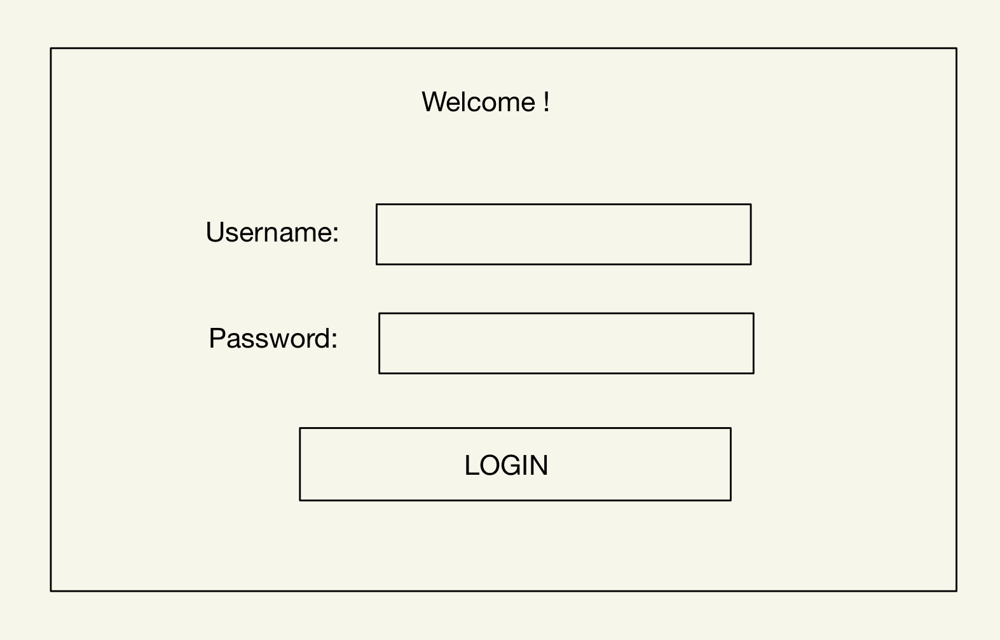
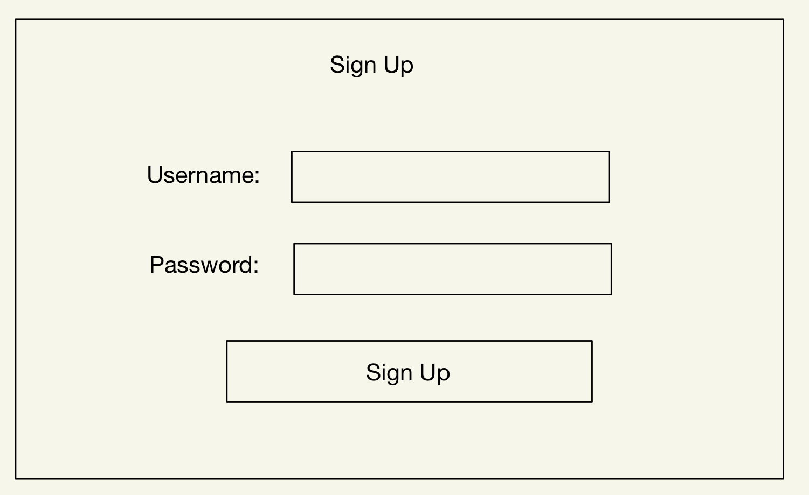

# ULC Learning Center Sign Up System

## Overview

The system will consists of mainly three parts. First part for users to sign up for tutoring of specific course. If there is available tutor, then information will be sent to tutors; otherwise, it will be added into a waitlist.

Tutors can get information of the current students, and manually ending the meeting with filling some information in the end. There is also a system for IA, who can keep track of all the tutors who are currently on shift, and see information of students in the waitlist, and manage their sessions.

## Data Model

The application will store Tutors, Sessions, Courses and Students

- Tutors can have multiple Courses (via references)
- Sessions will contain information of Students and Tutors (via references)

An Example Tutor:

```javascript
{
  name: "Helios Hu",
  hash: // a password hash,
  lists: // an array of references to Courses documents
  type: "Tutor" // another is IA
}
```

An Example Student:

```javascript
{
  netId: "xh2376",
  name: "Helios Hu",
  hash: // a password hash
}
```

An Example Session :

```javascript
{
  student: // a reference to a Student object
  tutor: // a reference to a Tutor object,
  courses: // a reference to a Course object,
  startTime: 3/14/2024,
}
```

An Example Course :

```javascript
{
  id: "CSCI-101"
  name: "Intro to Computer Science"
  location: "CIWW 102"
  Instructor: "Versoza "
}
```

## [Link to Commented First Draft Schema](db.mjs)

## Wireframes

(**TODO**: wireframes for all of the pages on your site; they can be as simple as photos of drawings or you can use a tool like Balsamiq, Omnigraffle, etc.)

/login - page for users to login



/sign-up - page for students in sign up for tutoring of specific course



/tutor - page for tutors seeing information of current student who needs tutoring


/session - page for IAs seeing all the sessions and manage them


/tutor-info - page for IAs seeing all the tutors that is on shift


## Site map


## User Stories or Use Cases

1. as non-registered user, I can register a new account with the site
2. as a user, I can log in to the site
3. as a user, I will redirect to different pages according to my account type
4. as a student, I can choose the course I need tutoring
5. as a tutor, I can see the information of my current session
6. as a tutor, I can finish the session when it is done
7. as a IA, I can see information of all tutors that is on shift
8. as a IA, I can see information of all sessions that is on going
9. as a IA, I can see information of all students that is in the waitlist
10. as a IA, I can assign student in the waitlist to the currectly available tutor

## Research Topics

(**TODO**: the research topics that you're planning on working on along with their point values... and the total points of research topics listed)

- (4 points) Integrate user authentication
  - I'm going to be using passport for user authentication
  - Redirect different users to different web pages
- (6 points) React
  - used React as the frontend framework;
  - lots of components is used lots of times, so using React can simplify the website
- (2 points) Bootstrap
  - use Bootstrap to design a theme for the whole system
  - Bootstrap is much more beautiful than CSS written by me

## [Link to Initial Main Project File](app.mjs)

(**TODO**: create a skeleton Express application with a package.json, app.mjs, views folder, etc. ... and link to your initial app.mjs)

## Annotations / References Used

1. I admit I have done all the mile stone by my self.
