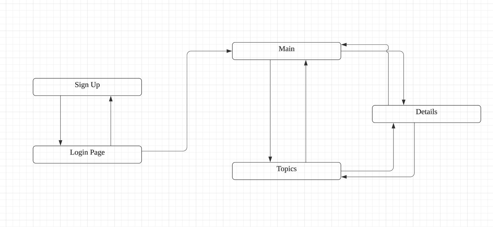

# Make a Vote

## Overview

The whole website mainly provide two functions for registered users. The first function is for users to create specific topics for votings. They can choose whether letting users to crate voting options or they can set different options in advance to let users choose.

All the topics will show up in the main pages. Users can look through different topics, and enter specific voting topics add options if allowed and make their vote.

## Data Model

The application will store Users, Topics, Options

- Topics can have multiple Options (by embedding)
- Topics can have one creator (which is a User) (via references)
- Users can have multiple Topics (there can be two type of Topics, topics they created and topics they attended) (via references)

An Example User:

```javascript
{
  name: "Helios Hu",
  hash: // a password hash,
  created: // an array of reference to Topics created by the User
  participated: // an array of references to Topics that the User participated in
}
```

An Example Topic with Embedded options:

```javascript
{
  topic: "How old are you?",
  owner: // a reference to the User who create this Topic
  createdAt: // time stamp
  options:[
    {answer: "19", voter: /* an array of reference to Users who chose this option*/},
    {answer: "20", voter: /* an array of reference to Users who chose this option*/}
  ]
}
```

## [Link to Commented First Draft Schema](db.mjs)

## Wireframes

/login - page for users to login


/sign-up - page for students in sign up for tutoring of specific course


/topics - page for displaying all the topics


/details - page for users to view options and make their vote


/main - page for users to view topics that they created and they participated


## Site map



## User Stories or Use Cases

1. as non-registered user, I can register a new account with the site
2. as a user, I can log in to the site
3. as a user, I can go to main page to view my information
4. as a user, I can see all the topics that I created
5. as a user, I can see all the topics that I participated
6. as a user, I can go to topics page to see all the topics
7. as a user, I can choose any topics that I am interested in and see its details
8. as a user, I can see all the options in the specific topic
9. as a user, I can make my vote in the topic

## Research Topics

- (4 points) Integrate user authentication
  - I'm going to be using passport for user authentication
  - Redirect different users to different web pages
- (6 points) React
  - used React as the frontend framework;
  - lots of components is used lots of times, so using React can simplify the website
- (2 points) Bootstrap
  - use Bootstrap to design a theme for the whole system
  - Bootstrap is much more beautiful than CSS written by me

12 points total

## [Link to Initial Main Project File](app.mjs)

## Annotations / References Used

I admit I have done all the mile stone by my self.
